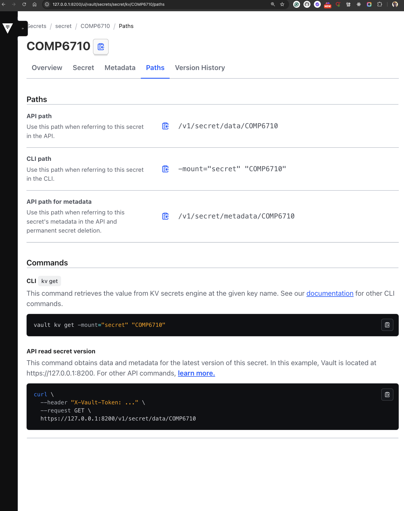

# Learn How to Use HashiCorp Vault and Setup guide for MacOS
### By Jahidul Arafat, Senior Solution Architect (DevOps and AppDev) 
ASEAN Cloud Engineering Team, JAPAC Solution Engineering Hub,
Oracle
https://www.linkedin.com/in/jahidul-arafat-presidential-fellow-phd-student-791a7490/



## 1. Introduction to HashiCorp Vault

HashiCorp Vault is a tool for securely accessing secrets, such as API keys, passwords, certificates, and encryption keys. It provides a robust access control mechanism and dynamic secret generation.

## 2. Installation Guide for macOS

### Prerequisites

- macOS (M1, M3, or Intel-based Mac)
- Homebrew installed

### Installation Steps

1. **Install Vault using Homebrew:**

   ```sh
   brew tap hashicorp/tap
   brew install hashicorp/tap/vault
   ```

2. **Verify the installation:**

   ```sh
   vault --version
   ```

   You should see an output like `Vault v1.xx.x` confirming successful installation.


## 3. Running Vault Server in Development Mode

To quickly test Vault, you can run it in **development mode**, which automatically initializes and unseals Vault.

```sh
vault server -dev
```

After starting, Vault will print an **Unseal Key** and **Root Token**. Note these down for later use.

## 4. Setting Up Vault CLI

Open a new terminal window and set the environment variable for Vault's address:

```sh
export VAULT_ADDR='http://127.0.0.1:8200'
```

Then login using the root token from the dev server output:

```sh
vault login <your-root-token>
```

## 5. Storing and Retrieving Secrets

### Step 1: Enable Key-Value (KV) Secret Engine; Optional, if the KV secret engine is not enabled yet

Vault supports different secret engines. The simplest one is the Key-Value (KV) engine.

```sh
vault secrets enable -path=secret kv-v2
```

### Step 2: Store a Secret

```sh
vault kv put secret/myapp username=auburn password=AubiTiger6710
```

### Step 3: Retrieve the Secret

```sh
vault kv get secret/myapp
```

Expected output:

```sh
====== Data ======
Key         Value
---         -----
password    AubiTiger6710
username    auburn
```

## 6. Using Vault with an Application

You can access secrets programmatically using Vault’s API:

### Fetch Secret Using cURL or even can use POSTMAN (if you are familiar with)

```sh
curl --header "X-Vault-Token: <your-root-token>" \
     --request GET \
     http://127.0.0.1:8200/v1/secret/data/myapp
```

### Simple TypeScript Application Using Vault

Below is a simple **TypeScript application** that retrieves a secret from Vault:

#### Initialize TypeScript Project

```sh
mkdir vault-app && cd vault-app
npm init -y
npm install typescript ts-node axios dotenv @types/node --save-dev
npx tsc --init
```

#### Install Dependencies

```sh
npm install axios dotenv
```

#### Create a `.env` file:

```env
VAULT_ADDR=http://127.0.0.1:8200
VAULT_TOKEN=<your-root-token>
SECRET_PATH=secret/data/myapp
```

#### TypeScript Code (`vaultClient.ts`):

```typescript
import axios from 'axios';
import dotenv from 'dotenv';

dotenv.config();

const VAULT_ADDR = process.env.VAULT_ADDR;
const VAULT_TOKEN = process.env.VAULT_TOKEN;
const SECRET_PATH = process.env.SECRET_PATH;

async function fetchSecret() {
    try {
        const response = await axios.get(`${VAULT_ADDR}/v1/${SECRET_PATH}`, {
            headers: { 'X-Vault-Token': VAULT_TOKEN }
        });
        console.log('Secret Data:', response.data.data);
    } catch (error) {
        console.error('Error fetching secret:', error);
    }
}

fetchSecret();
```

#### Run the Application

```sh
npx ts-node vaultClient.ts
```

## 7. Secure Vault in Production

For production use, **do not run Vault in dev mode**. Instead:

- Use **Consul** or **Integrated Storage** for persistence.
- Use **TLS encryption**.
- Enable **authentication methods** like GitHub, LDAP, or AppRole.
- Set up **Vault Policies** for fine-grained access control.

## 8. Conclusion

This guide covered installing Vault on macOS, running it in dev mode, storing secrets, and accessing them programmatically with a simple TypeScript application. In production, configure Vault with storage backends and authentication methods for enhanced security.

For more advanced use cases, refer to the [official documentation](https://developer.hashicorp.com/vault/docs).

